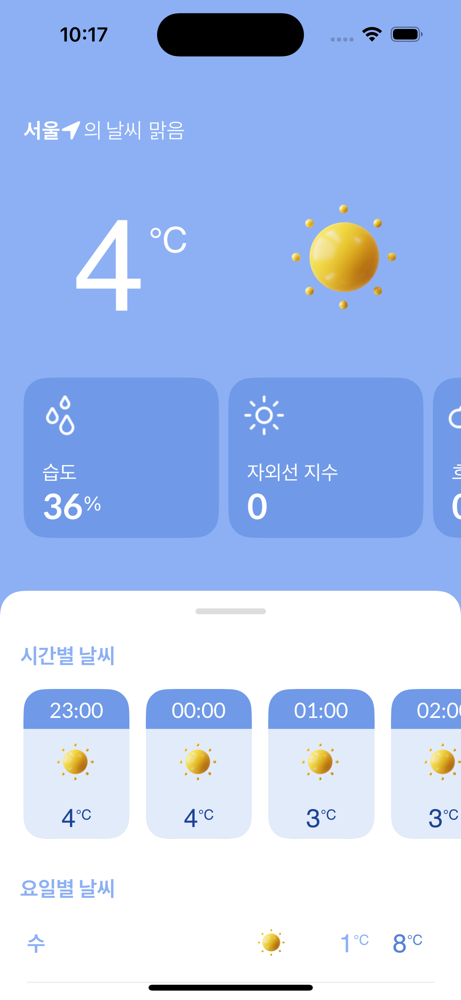
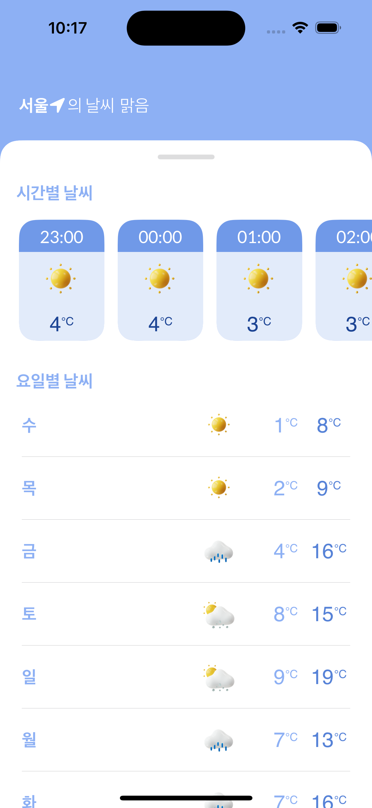
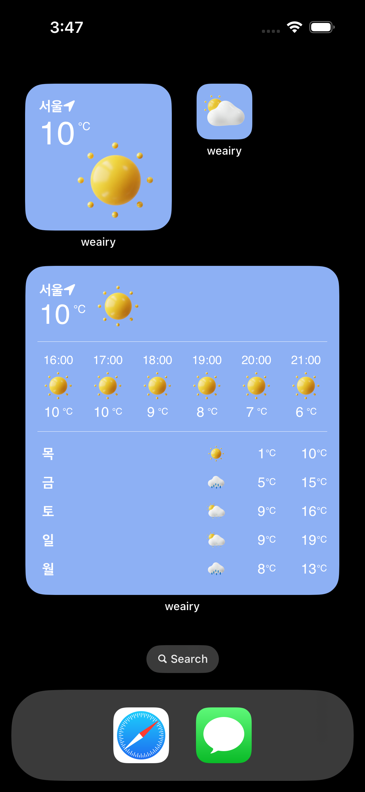
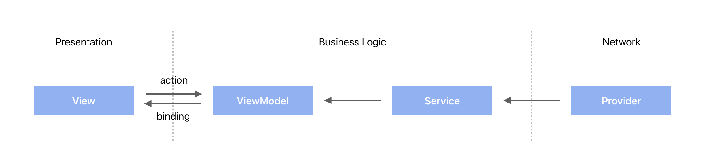
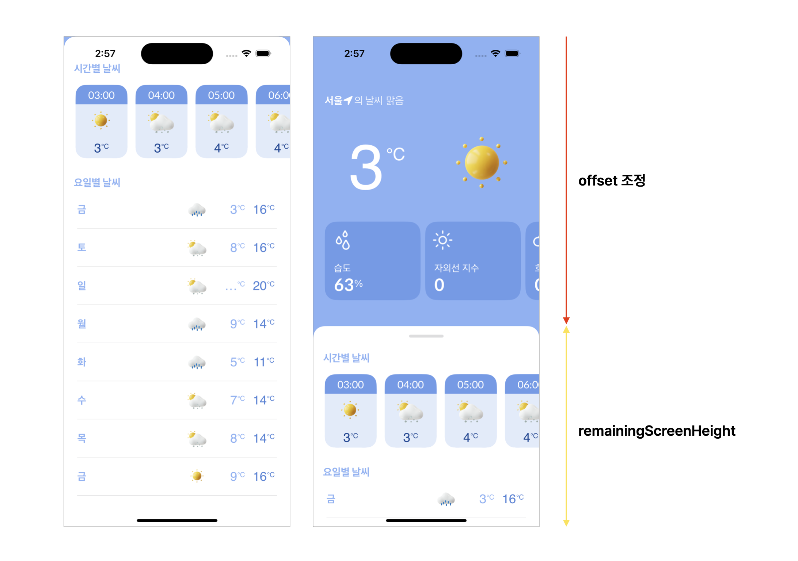
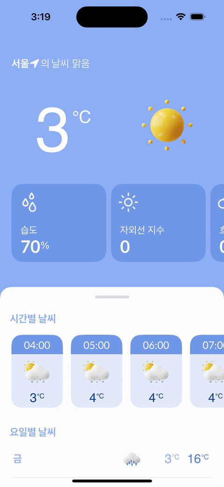

# Weairy
날씨요정이 날씨를 알려주는 날씨앱

|||||
|:-:|:-:|:-:|:-:|
|오늘의 날씨|시간/요일별 날씨|검색|위젯|

## 목차

[프로젝트 정보](#프로젝트-정보)  
[주요 기능](#주요-기능)  
[기술 스택](#기술-스택)  
[구현 내용](#구현-내용)  
[문제 및 해결](#문제-및-해결)  
[회고](#회고)

## 프로젝트 정보

- 최소 버전: iOS 16.0
- 개발 환경: Xcode 15.0.1, swift 5.9
- 개발 기간: 24.03.13 ~ 24.03.20 (7일)
- 개발 인원: 1명

## 주요 기능

- 현재 날씨, 시간별/요일별 날씨 정보 제공
- 도시 이름 자동 완성 기능
- 크기별 위젯 기능
- 날씨 알림 기능


## 기술 스택

- `SwiftUI` `MVVM` `Combine`
- `WidgetKit` `UserNotifications`
- `CoreLocation` `MapKit`
- `Moya(15.0.3)`

## 구현 내용

- OpenWeatherAPI를 이용한 데이터 소싱
- WidgetKit을 이용한 크기별 위젯 구현
- CoreLocation을 이용해 현재 위치 날씨 제공
- MapKit을 이용한 도시 검색 자동 완성 기능
- UserNotifications를 이용한 날씨 알림 기능

### Architecture



## 문제 및 해결

### 1. sheet 아래 view와의 상호작용

#### 🚨 문제 상황

화면의 상단에는 현재 날씨를 보여주는 뷰가 위치하고, 하단에는 시간별 또는 요일별 날씨 정보를 보여주는 뷰가 시트 형태로 존재. 현재 날씨 뷰는 고정된 상태로 유지되며, 사용자가 시간별 또는 요일별 날씨 뷰를 보기위해서 시트가 올라와야 함.  
현재 날씨 뷰 내부에는 사용자가 좌우로 스크롤하여 자세한 날씨 정보를 볼 수 있는 수평 스크롤 기능이 포함되어 있기때문에 시트가 올라와있는 채로 현재 날씨 뷰와 상호작용 할 수 있어야 함. sheet가 present 상태일 때에도 뒤에 있는 view와 상호작용 할 수 있게 해주는 modifier인 presentationBackgroundInteraction가 iOS 16.4 이상부터 사용가능한 문제 발생

#### ✅ 해결

dragGesture와 offset을 활용해 custom sheet 구현.

##### 시도 #1
현재 날씨 뷰와 시간/요일 날씨 뷰 모두 scrollView 적용

- 시간/요일 날씨 뷰 높이 확보를 위해서 모두 scrollView 적용
- 현재 날씨 뷰는 .scrollDisabled 를 사용하여 스크롤 되지 않도록 함
- 시간/요일 날씨 뷰는 시트가 올라왔을 시에만 스크롤 가능하도록 함
- scrollView 중첩으로 인해 시간/요일 날씨 뷰에서 제대로 스크롤 되지 않는 문제 발생

##### 시도 #2
시간/요일 날씨 뷰에만 scrollView 적용

- remainingScreenHeight: 현재 날씨 뷰를 제외한 나머지 뷰의 높이
- (전체 화면 높이 - remainingScreenHeight - 상단 safeArea 높이) 만큼 offset 조정
- DragGesture에 따라서 시간/요일 날씨 뷰가 움직이도록 구현



```swift
// 시간,요일별 날씨 정보 view
    .offset(y: forecastViewOffsetHeight)
    .animation(.spring(), value: forecastViewOffsetHeight)
    .gesture(
        DragGesture()
            .onChanged { gesture in
                let gestureY = gesture.translation.height
                
                forecastViewOffsetHeight = (showForcastView ? expandOffsetHeight : plainOffsetHeight) + gestureY
                
                // 최소, 최대 offset 지정
                if forecastViewOffsetHeight < expandOffsetHeight {
                    // forcastView가 expandOffset보다 위에 위치하지 않도록 제한
                    forecastViewOffsetHeight = expandOffsetHeight
                } else if forecastViewOffsetHeight > plainOffsetHeight {
                    // forcastView가 plainOffsetHeight보다 아래에 위치하지 않도록 제한
                    forecastViewOffsetHeight = plainOffsetHeight
                }
                
            }
            .onEnded { value in
                let gestureY = value.location.y - value.startLocation.y
                
                let isDraggingUp = gestureY < 0
                let isDraggingDown = gestureY > 0
                let threshold: CGFloat = 150
                
                if isDraggingUp && gestureY < -threshold {
                    showForcastView = true
                } else if isDraggingDown && gestureY > threshold {
                    showForcastView = false
                }
                
                forecastViewOffsetHeight = showForcastView ? expandOffsetHeight : plainOffsetHeight
            }
    )
```
||
|:-:|
|해결|

### 2. 실시간 날씨 정보

#### 🚨 문제 상황

- onAppear에서 fetchWeather를 실행하도록 설정
- 오랜 시간 앱을 사용하지 않았다가 다시 앱을 띄웠을 때 최신 날씨 정보가 업데이트 되지 않는 문제 발생

#### ✅ 해결

onChange 메서드를 사용하여 앱이 Background 상태에서 active 상태로 전환될 때, fetchWeather 메서드가 실행되도록 수정  
+) onChange(of:perform:) 메서드는 iOS 17.0 이상부터 Deprecated. Custom Modifier를 만들어 분기처리

```swift
// Custom Modifier
struct OnChangeWithCondition<V: Equatable>: ViewModifier {
    
    let value: V
    let completion: (V) -> Void
    
    init(
        value: V,
        completion: @escaping (V) -> Void
    ) {
        self.value = value
        self.completion = completion
    }
    
    func body(content: Content) -> some View {
        if #available(iOS 17.0, *) {
            content
                .onChange(of: value) { oldValue, newValue in
                    completion(newValue)
                }
        } else {
            content
                .onChange(of: value, perform: { newValue in
                    completion(newValue)
                })
        }
    }
    
}

extension View {
    func onChangeWithCondition<V: Equatable>(
        of value: V,
        completion: @escaping (V) -> ()
    ) -> some View {
        modifier(OnChangeWithCondition(value: value, completion: completion))
    }
}

```
```swift
// WeatherView
.onChangeWithCondition(of: scenePhase) { newScenePhase in
    guard newScenePhase == .active else { return }
    
    vm.fetchWeather(of: selectedCoordinates)
}
```

## 회고

### SwiftUI 사용기

UIKit에 비해 더 적은 코드로도 뷰를 구성할 수 있어서 매우 간편했습니다. 작은 뷰들을 모아서 하나의 큰 뷰를 만드는 과정이 레고를 조립하는 것 같아서 즐겁게 UI를 만들 수 있었습니다. UIKit의 명령형 프로그래밍 패러다임에 익숙해져 있다가 RxSwift를 통해 선언형 프로그래밍 패러다임을 접했을 때에도 신선했는데, SwiftUI는 더 간결하게 프로그래밍을 할 수 있어서 놀라웠습니다.  
그런데 SwiftUI가 아직 발전중이라서 Deprecated되거나 높은 버전에서만 지원되는 등의 문제가 있었습니다. 때문에 이런 점들을 잘 고려해서 사용해야겠다고 느꼈습니다. 
